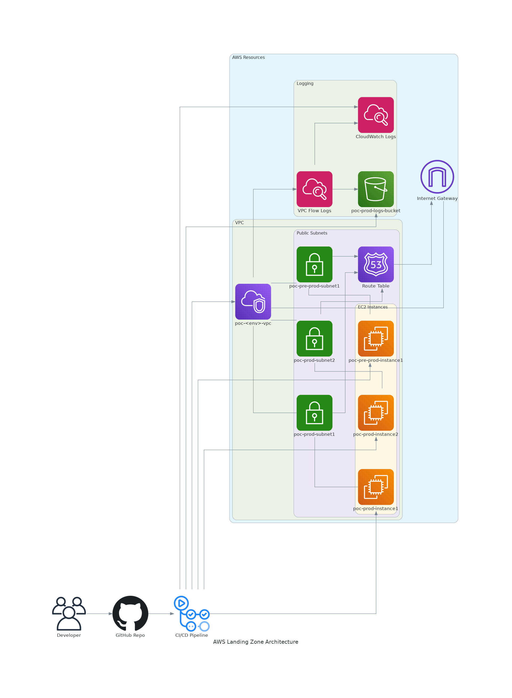
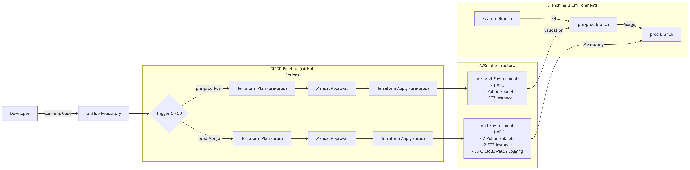

## AWS Landing Zone Terraform POC



## Overview

This repository implements a proof-of-concept AWS Landing Zone using Terraform, designed to work within AWS Free Tier limits. The solution automates the provisioning of core infrastructure with GitHub Actions CI/CD pipelines.

## Features

- **Core Networking**: VPC, subnets, route tables, and internet gateway
- **Compute Resources**: EC2 instances with security groups
- **Centralized Logging**: VPC Flow Logs to S3 and CloudWatch
- **Environment Isolation**: Separate pre-prod and prod environments
- **Automated Deployment**: CI/CD pipeline via GitHub Actions

## Repository Structure

```
test_aws_land_zone/
├── README.md
├── diagrams
│   ├── architecture.py
│   ├── aws_landing_zone_architecture.png
│   ├── workflow.mermaid
│   └── workflow.png
├── environments
│   ├── outputs.tf
│   ├── pre-prod
│   │   ├── backend.tf
│   │   ├── main.tf
│   │   ├── outputs.tf
│   │   ├── terraform.tfvars
│   │   └── variables.tf
│   ├── prod
│   │   ├── backend.conf
│   │   ├── main.tf
│   │   ├── outputs.tf
│   │   ├── terraform.tfvars
│   │   └── variables.tf
│   ├── providers.tf
│   └── variables.tf
├── modules
│   ├── compute
│   │   ├── main.tf
│   │   ├── outputs.tf
│   │   └── variables.tf
│   ├── logging
│   │   ├── main.tf
│   │   ├── outputs.tf
│   │   └── variables.tf
│   └── networking
│       ├── main.tf
│       ├── outputs.tf
│       └── variables.tf
└── remote_state_S3.sh

9 directories, 28 files
```

## CI/CD Workflow



The GitHub Actions pipeline:
1. Triggers on pushes to `pre-prod` or `prod` branches
2. Runs `terraform init`, `validate`, and `plan`
3. Applies changes automatically after approval
4. Maintains separate state files for each environment

## Getting Started

### Prerequisites
- AWS account with Free Tier eligibility
- Terraform installed (v1.0+)
- GitHub repository access

### Deployment Steps

1. Clone the repository:
```bash
git clone https://github.com/98-Anas/test_aws_land_zone.git
cd test_aws_land_zone
```

2. Deploy to pre-production:
```bash
cd envs/pre-prod
terraform init
terraform plan
terraform apply
```

3. Deploy to production:
```bash
cd ../prod
terraform init
terraform plan
terraform apply
```

### CI/CD Pipeline
- Push to `pre-prod` branch deploys to pre-production environment
- Merge to `prod` branch deploys to production environment

## Terraform Commands

```bash
# Initialize Terraform
terraform init

# Validate configuration
terraform validate

# Show execution plan
terraform plan

# Apply changes
terraform apply

# Destroy infrastructure
terraform destroy
```

## Resource Naming Convention

All resources follow the pattern: `poc-<env>-<resource>`
- Example VPC: `poc-pre-prod-vpc`
- Example EC2 instance: `poc-prod-instance1`
- Example log group: `poc-prod-logs`

## Future Enhancements

1. Implement more granular IAM policies
2. Add monitoring and alerting
3. Expand logging capabilities
4. Implement cost monitoring
5. Add security scanning in CI/CD pipeline

## License

MIT License - see [LICENSE](LICENSE) file for details.
